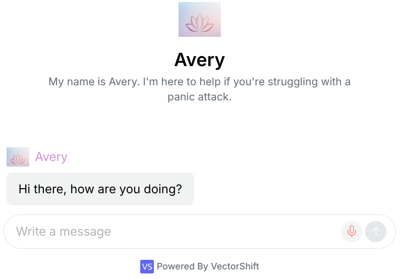
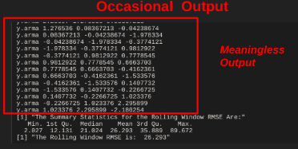
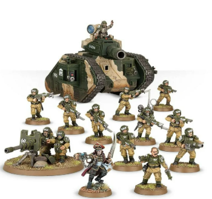
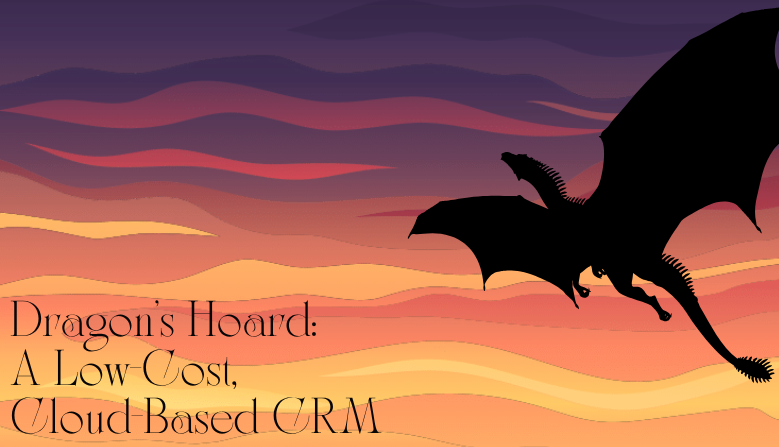
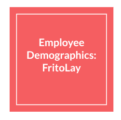
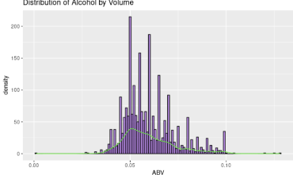

# [Conversational AI and AI Governance in Vectorshift](https://github.com/jlaskow/Conversation-AI-and-AI-Governance-in-Vectorshift)

###### *Date: May, 2025*

###### This project sets out to build a chatbot that assists users experiencing panic attacks. Avery, the final bot, works by walking users through the 54321 grounding technique. Avery is designed in accordance with the AI RMF 1.0, a framework designed by the US Department of Commerce to outline the steps necessary for development of safe, ethical AI. Chatbot responses are evaluated using independent llm models to guage professionalism and appropriateness. Avery also incorporates multiple developmental guardrails and protective layers to limit harmful output, including the ability to recognize intent to harm self or others and provide relevant crisis-control resources.

##### Topics
- AI
- Chatbots
- Ethical AI Development
- Embedding
- HIPAA Protections

##### Tools
- Vectorshift
- Perplexity
- Gemini
- Anthropic
- Cohere

---

# [*tswge* Modifications (Ongoing)](https://github.com/jlaskow/tswge-Modifications)

###### An ongoing project to fix quality of life bugs in *tswge*, a time-series package for R. Common bugs include output and formatting errors that generate irrelevant information. Additional fixes include new functions for users.

##### Topics
- Bug Testing
- Bug Fixing
- Function Creation

##### Tools
- R

---

# [Tactical Insights into the Astra Militarum (Ongoing)](https://github.com/jlaskow/Tactical-Insights-into-the-Astra-Militarum)

###### An ongoing project exploring the common playstyles of the Astra Militarum, a faction in the table-top game Warhammer 40K. The project seeks to store freely available data in a NoSQL Cloud server for rapid access. The project also seeks to develop tools, metrics, and strategies for players to use to gauge strategic viability during games.

##### Topics
- Resource Management
- NoSQL Cloud Servers
- Exploratory Data Analysis
- Feature Engineering
- User Interface

##### Tools
- MongoDB Cloud
- Jupyter Notebooks

---

# [Assessing Time Series Relationships Between South Korean KOSPI and US NASDAQ](https://github.com/jlaskow/Assessing-Time-Series-Relationships-Between-South-Korean-KOSPI-and-U.S.-NASDAQ-)

###### *Date: December, 2024*

###### A group project attempting to see how fluctuations in KOSPI index might be used to predict future performance of NASDAQ. Project was met with limited success, but provided a strong foundation into the applications and limitations of time series models.

##### Topics
- Economics
- Time Series

##### Tools
- R

---

# [Dragon's Hoard: A Free-Use CRM for Wholesale Distributors of TTRPG Merchandise](https://github.com/jlaskow/Dragons-Hoard-Free-Use-CRM-for-Wholesale-Distributors-of-TTRPG-Merchandise?tab=readme-ov-file)

###### *Date: July, 2024*

###### A group project that set out to construct a low-cost data pipeline for a hypothetical distributor of TTRPG merchandise. The data pipeline uses open-source and low-cost services to build a cloud-based data warehouse that could be linked to a CRM.

##### Topics
- Cloud and Local Relational Database Management Systems
- SQL
- Data Crawlers

##### Tools
- mySQL
- AWS
- RDS
- GLUE
- Redshift
- Looker Studio

---

# [Advanced Predictive Modeling Techniques to Anticipate Medical Expenses Among Smokers and Non-Smokers](https://github.com/jlaskow/Advanced-Predictive-Modeling-Techniques-to-Anticipate-Medical-Expenses-Among-Smokers-and-Non-Smokers)

###### *Date: June, 2024*

###### Application of advanced modeling techniques to predict medical expenses from limited patient information.

##### Topics
- Multiple Linear Regression
- Random Forest
- KNN
- Ensembling
- Cross Validation

##### Tools
- R

---

# [Deciphering Earnings](https://github.com/jlaskow/Deciphering-Earnings)

###### *Date: May, 2024*

###### A collaborative project utilizing advanced predictive techniques to predict income levels above $50K.

##### Topics
- Feature Selection
- Tree Maps
- Multicollinearity
- PCA
- Logistic Regression
- LDA/QDA
- Random Forest
- CaRT
- Feed Forward Neural Networks

##### Tools
- R

---

# [House Price Predictions in Ames, Iowa](https://github.com/jlaskow/Kaggle-House-Price-Predictions-in-Ames-Iowa)

###### *Date: May, 2024*

###### A group project using multiple linear regression models to predict housing prices in Ames, Iowa. Final Kaggle Score of all predictions: 0.20623 (within top 15% of all predictions submitted).

##### Topics
- Multiple Linear Regression

##### Tools
- R

---

# [Employee Demographics for Fritolay](https://github.com/jlaskow/Employee-Demographics-for-FritoLay)

###### *Date: December, 2023*

###### Using KNN clustering and Naive Bayes to predict employee attrition, and using linear regression to predict anticipated employee salary.

##### Topics
- Multiple Linear Regression
- KNN
- Naive Bayes

##### Tools
- R

---

# [Beers and Breweries](https://github.com/jlaskow/Beers-and-Breweries)

###### *Date: November, 2023*

###### A group exploration of readily available brewery data from Budweiser. EDA identifies key trends that we believe could be useful for future analysis. Observations include distribution of alcohol by volume, median alcohol content by state, and potential classification models (KNN) to predict IPA vs Non-IPA based on Alcohol by Volume (ABV) and International Bitterness Units (IBU).

##### Topics
- EDA
- KNN

##### Tools
- R
